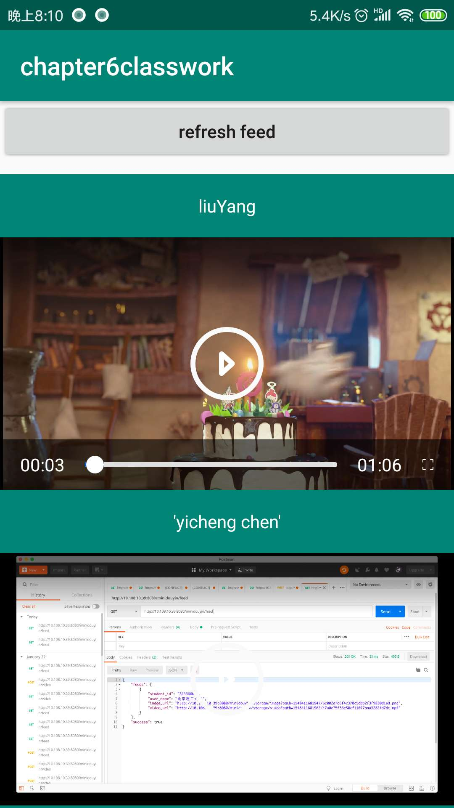
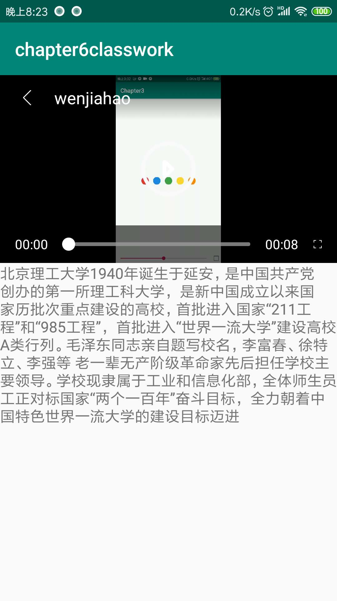

# chapter6classwork
chapter6: classwork of ByteDance Android training in BIT

## 作业完成情况记录

实现两个功能点：

1. 视频列表 -> 视频详情页
2. 列表自动播放

* 视频列表 -> 视频详情页

1. 发起网络请求Feed流，获取到多个（视频、封面、姓名和学号等）Feed信息，再通过RecycleView显示视频，并显示视频封面；通过在RecycleView中添加itemView点击时间监听器，实现点击视频列表中的视频跳转到视频详情页。(点击refresh feed,刷新视频流信息) 简单地实现视频列表和视频详情页如下所示：

<p align="center">
    
    <p align="center">
        <em>视频列表</em>
    </p>
</p>

<p align="center">
    
    <p align="center">
        <em>视频详情页</em>
    </p>
</p>

* 列表自动播放功能

2. 通过对RecyclerView设置`addOnScrollListener`滚动事件监听器，监听列表滑动和列表滑动状态变化时间。在列表滑动状态变化事件`onScrollStateChanged`方法中,当滑动停止时，找出第一个处于屏幕完全可见状态的视频，执行播放操作即可实现自动播放。主要代码逻辑如下：

```java
            @Override
            public void onScrollStateChanged(RecyclerView recyclerView, int newState) {
                super.onScrollStateChanged(recyclerView, newState);
                Log.d(TAG, "onScrollStateChanged");
                switch (newState) {
                    case RecyclerView.SCROLL_STATE_IDLE:
                        //滚动停止
                        //判断视频位置，自动播放
                        autoPlayVideo(recyclerView);
                        break;
                    case RecyclerView.SCROLL_STATE_DRAGGING:
                        //手指拖动
                        break;
                    case RecyclerView.SCROLL_STATE_SETTLING:
                        //惯性滑动
                        break;

                }

            }

private void autoPlayVideo(RecyclerView view) {
        RecyclerView.LayoutManager layoutManager = view.getLayoutManager();
        for (int i = 0; i < visibleCount; i++) {
            StandardGSYVideoPlayer gsyVideoPlayer = layoutManager
                    .getChildAt(i).findViewById(R.id.video_item_player);
            Rect rect = new Rect();
            if (gsyVideoPlayer.getLocalVisibleRect(rect)) {
                if (rect.height() == gsyVideoPlayer.getHeight()) {
                    Log.d(TAG, "播放视频:" + gsyVideoPlayer.getCurrentState());
                    gsyVideoPlayer.getStartButton().performClick();
                    return;
                }
            }
        }
        GSYVideoManager.releaseAllVideos();
    }
```


**最后App实现效果演示如下所示：**

<p align="center">
    
    <p align="center">
        <em>视频详情页</em>
    </p>
</p>


最后记录一下Gradle build配置文件，老师给的配置文件能编译通过，暂时还不清楚原因，以备后续进一步学习。

```gradle
apply plugin: 'com.android.application'

android {
    compileSdkVersion 27
    buildToolsVersion '28.0.3'

    defaultConfig {
        applicationId "cn.edu.bit.codesky.chapter6classwork"
        minSdkVersion 16
        targetSdkVersion 27
        versionCode 1
        versionName "1.0"
        testInstrumentationRunner "android.support.test.runner.AndroidJUnitRunner"
        multiDexEnabled true
    }
    buildTypes {
        release {
            minifyEnabled false
            proguardFiles getDefaultProguardFile('proguard-android.txt'), 'proguard-rules.pro'
        }
    }
    compileOptions {
        sourceCompatibility 1.8
        targetCompatibility 1.8
    }
}

dependencies {
    implementation fileTree(dir: 'libs', include: ['*.jar'])
    implementation 'com.shuyu:GSYVideoPlayer:6.0.2'
    implementation 'com.android.support:appcompat-v7:27.1.0'
    implementation 'com.android.support:support-v4:27.1.0'
    implementation 'com.android.support:recyclerview-v7:27.1.0'
    implementation 'com.android.support:design:27.1.0'
    implementation 'com.android.support:cardview-v7:27.1.0'
    implementation "com.github.bumptech.glide:glide:4.8.0"
    implementation 'com.android.support.constraint:constraint-layout:1.1.3'
    annotationProcessor "com.github.bumptech.glide:compiler:4.8.0"

    testImplementation 'junit:junit:4.12'
    androidTestImplementation 'com.android.support.test:runner:1.0.2'
    androidTestImplementation 'com.android.support.test.espresso:espresso-core:3.0.2'

    implementation 'com.google.code.gson:gson:2.8.5'
    implementation 'com.squareup.retrofit2:retrofit:2.5.0'
    implementation 'com.squareup.okhttp3:logging-interceptor:3.11.0'
    implementation 'com.squareup.retrofit2:converter-gson:2.5.0'
}

```
